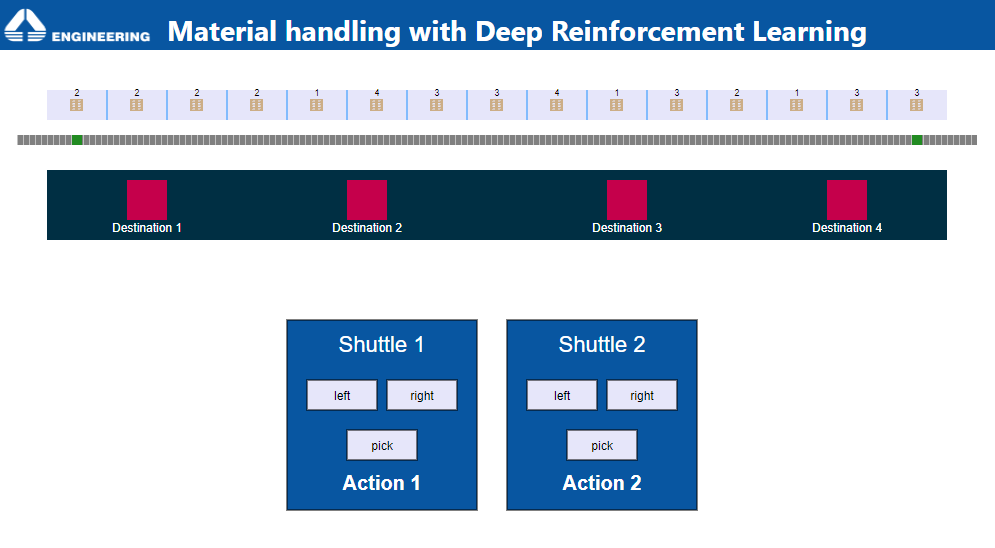

# Material handling with Deep Reinforcement Learning

In this simulation model is proposed an application of Deep Reinforcement Learning (DRL) for material
handling related to the manufacturing industries.\
Material handling is the process of movimentating materials from place to another within
a manufacturing plant. The costs for this activity are not negligible (such as 
labor, equipment, time and distance) and therefore material handling heuristics are continuously changed
to meet production constraints and customer demand by adjusting resources accordingly.
Thus, it is increasingly important to have a very flexible materials management system, 
which makes optimal decisions quickly in order to best handle uncertain situations.

### Use case
In the example realised there are two shuttles responsible for transporting materials
(one material at a time) sharing the same track. The materials are placed in the pallet rack
and each is assigned a destination chosen from 4 destinations. Once the pallet has arrived at
its destination, it remains at the destination for a fixed time, after which the destination will
be free again. 
The objective is to transport the materials to their destinations in the shortest possible time,
avoiding collisions between the two shuttles and considering that each destination can hold a 
maximum of 1 pallet at the same time. \
The creation of the policy to control the two shuttles was done with Microsoft Project Bonsai.

#### Actions

| Action      | Discrete value |
|:-----------:|:--------------:|
|no_action    | 0              |
|left         | 1              |
|right        | 2              |
|pick_pallet  | 3              |

The movements of the shuttles are discrete, i.e. they move towards the left or right
cell of the pallet rack. When the 'pick_pallet' action is performed, the shuttle picks up
the material in front of it and automatically takes it to its destination.

#### State

| State      | Domain          |  Type    | Description |
|:-----------:|:--------------:|:--------:|:-----:| 
|pallet_state | [0,4]          | array[15] of discrete integer values | 0 if pallet rack cell is empty, otherwise the number of the pallet's destination|
|shuttle1_start_position|[0,14] | discrete integer value | current position index of shuttle 1|
|shuttle2_start_position| [0,14] | discrete integer value| current position index of shuttle 2|
|destination| [0,1] | array[4] of discrete integer values| 0 if the i-th destination is occupied, 1 if it is free|
|shuttle_is_delivering| [-1,13] | array[2] of discrete integer values| -1 if the shuttle is not transporting pallets, otherwise a discrete index of the final position of the shuttle to arrive at|
|distance| [-14,14] | discrete interger values| distance between the two shuttles (shuttle1_start_position - shuttle2_start_position)|

#### Simulation mode
simulation can be performed in 3 modes:
- Manual, to manage shuttles manually
- Training, to train the model with Microsoft Bonsai
- Assessment, to assess the performance of the trained brain

Remember to set the parameters of Bonsai Connector object to train or assess your DRL model.